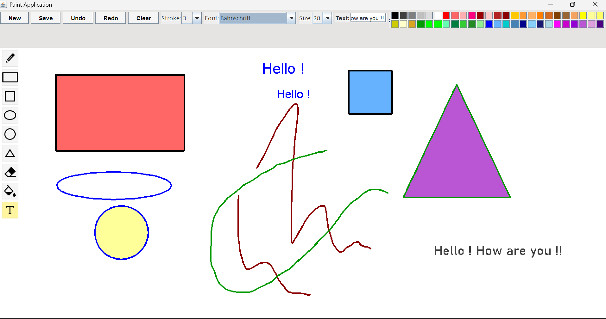

# 🎨 Java Swing Desktop Paint Application

[](https://www.oracle.com/java/)

[](#-software-architecture--design-patterns)

A high-performance, object-oriented desktop raster graphics editor built in **Java Swing and AWT**. Designed with modular Swing components, event-driven architecture, and custom rendering pipelines to support freehand drawing, geometric vector-to-raster transformations, flood fills, and $O(1)$ state undo/redo operations.

---

## 📸 Overview & Demo

> *A clean, responsive UI offering a desktop-grade drawing experience powered by Java graphics acceleration.*


 

---

## 🏗️ Software Architecture & Design Patterns

This application is built with core enterprise engineering principles, ensuring clean separation of concerns and maintainable graphics state tracking:

```text
                  ┌─────────────────────────────────────┐
                  │              MainUI                 │
                  └──────────────────┬──────────────────┘
                                     │
         ┌───────────────────────────┴───────────────────────────┐
         ▼                                                       ▼
┌──────────────────┐                                   ┌──────────────────┐
│   ToolSidebar    │                                   │   PaintCanvas    │
└────────┬─────────┘                                   └────────┬─────────┘
         │                                                       │
         ▼                                                       ▼
┌──────────────────┐  <-- Uses Command Pattern -->     ┌──────────────────┐
│ Tool Selection   │  <-- Updates Canvas State -->     │ Dual Stack       │
│ & Color Palette  │                                   │ Undo/Redo Engine │
└──────────────────┘                                   └──────────────────┘

```

### 🔑 Key Engineering Highlights

* **Command Pattern for Undo/Redo Engine:** Implements state history using a dual `Stack<BufferedImage>` structure. This enables time-constant $O(1)$ state push and pop operations for instantaneous undo/redo transitions without canvas latency.
* **Double-Buffering & Off-Screen Rendering:** Uses custom `BufferedImage` objects as off-screen graphics context to prevent screen flickering during rapid mouse drag events (`MouseMotionListener`).
* **Modular MVC Layout:** Separates tool configurations (`ToolSidebar`, `ToolbarPanel`) from the primary graphics context (`PaintCanvas`) to enforce low coupling and high cohesion.
* **Polymorphic Geometry Engine:** Standardizes shapes (Rectangles, Ovals, Circles, Triangles) and text overlays into uniform graphic primitives before rasterizing onto the canvas.

---

## ✨ Features & Capabilities

* 🖊️ **Precision Drawing Tools:** Dynamic pen/pencil with adjustable stroke width and custom eraser.
* 📐 **Geometric Primitives:** Instant vector-like shape generation for Rectangles, Squares, Circles, Ovals, and Triangles.
* 🪣 **Raster Flood Fill:** Algorithms engineered to fill contiguous pixel regions with solid colors.
* 🔤 **Text Overlay Tool:** Multi-font, scalable text insertion with live spatial positioning.
* 🎨 **Color Management:** Quick-access swatches with RGB customization.
* 🔄 **State Persistence (Undo/Redo):** Complete transactional history tracking for actions.
* 💾 **Image Export Engine:** High-fidelity raster rendering exported directly into lossless **PNG** format.

---

## 📂 Project Structure

```text
PaintAWT/
├── src/
│   └── com/
│       └── paintapp/
│           ├── Main.java          # Application entry point & frame setup
│           ├── PaintCanvas.java   # Core rendering engine & event handling
│           ├── ToolbarPanel.java  # Top action bar (Undo, Redo, Save)
│           ├── ToolSidebar.java   # Tool selection panel
│           ├── ToolIcon.java      # UI custom icon wrappers
│           ├── Tool.java          # Tool state enumeration / configuration
│           ├── Constants.java     # Application-wide global constants
│           └── ImageUtils.java    # File I/O & PNG export utilities
│
├── bin/                           # Compiled bytecode (.class files)
├── screenshots/                   # Application demonstration previews
├── README.md                      # Technical documentation
└── .gitignore                     # Git tracking exclusions

```

---

## 🛠️ Prerequisites & Installation

### Prerequisites

* **Java Development Kit (JDK):** Version 8 or higher
* **Git:** For repository cloning

Verify your local environment:

```bash
java -version
javac -version

```

### 1. Clone Repository

```bash
git clone [https://github.com/trushi-jasani/java-awt-paint-project.git](https://github.com/trushi-jasani/java-awt-paint-project.git)
cd java-awt-paint-project

```

### 2. Compilation

**Windows (PowerShell):**

```powershell
javac -d bin src/com/paintapp/*.java

```

**Linux / macOS:**

```bash
javac -d bin src/com/paintapp/*.java

```

### 3. Execution

**Windows (PowerShell):**

```powershell
java -cp bin com.paintapp.Main

```

**Linux / macOS:**

```bash
java -cp bin com.paintapp.Main

```

---

## 🧪 Clean Build Artifacts

To clear compiled `.class` files from the project workspace:

**Windows (PowerShell):**

```powershell
Get-ChildItem -Path bin -Recurse -Include *.class | Remove-Item

```

**Linux / macOS:**

```bash
rm -rf bin/com/paintapp/*.class

```

---

## 🤝 Contributing

Contributions are welcomed! Feel free to open an issue or submit a pull request:

1. Fork the Repository
2. Create a Feature Branch (`git checkout -b feature/OptimizedBrushEngine`)
3. Commit Changes (`git commit -m 'Added anti-aliasing to freehand brush'`)
4. Push to Branch (`git push origin feature/OptimizedBrushEngine`)
5. Open a Pull Request

---

## 👩‍💻 Author

**Trushi Jasani**

* **GitHub:** [github.com/trushi-jasani](https://github.com/trushi-jasani)
* **Email:** [jasanitrushi@gmail.com](https://www.google.com/search?q=mailto%3Ajasanitrushi%40gmail.com)

---

```

```
